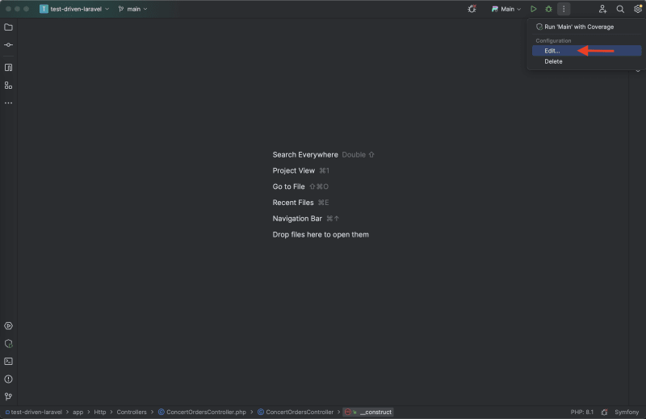

## Application start
To start application run these commands in provided order in project directory
- Copy all environment variables from example file to actual
```
cp .env.example .env
```
- Build php container using custom docker file
```
sudo docker compose build app
```
- Start all docker containers and there network
```
sudo docker compose up -d
```
- Install all composer dependencies in app docker container
```
sudo docker compose exec app composer install
```
- Generate artisan keys
```
sudo docker compose exec app php artisan key:generate
```
- Run all needed migrations
```
sudo docker compose exec app php artisan migrate
```
- Install Laravel Passport package
```
sudo docker compose exec app php artisan passport:install
```
## Setup connection to database from PhpStorm
1. Add MySQL data source in database menu 
2. In properties of database enter such data:
- Host: ```localhost```
- Port: ```3306```
- User: ```meesttesttask_user```
- Password: ```password```
- Database: ```meesttesttask```
## Connecting xDebug to PhpStorm
xDebug is already installed in docker container if you run application start instruction. To connect debugger to PhpStorm you should repeat next steps.
Firstly, if you do not enable non-root user access, enter these commands:
- Add docker group on system
```
sudo groupadd -f docker
```
- Add the active user to the docker group
```
sudo usermod -aG docker $USER
```
- Reboot the system

Next you should check if PhpStorm can connect to docker in Settings -> Build,Execution,Deployment -> Docker (Right-bottom corner).
After that, go to Settings -> PHP -> Servers, then clicking on the plus sign.
Enter in the right menu such parameters:
- Name: Docker_laravel
- Host: localhost
- Port: 8000
- Absolute path for Project files: /var/www
- Absolute path for Project files -> project path -> public -> index.php: /var/www/public/index.php

Add port 9009 to ports list in the Settings -> Php -> Debug, xDebug tab. Then Open Run/Debug Configurations window as described on the screenshot:

Click into Add New Configuration -> PHP Remote Debug. In opened menu enter fields:
- Name: Docker
- Filter debug connection by IDE key; true
- Server: Docker_laravel
- IDE key: PHPSTORM

Connecting is finished.
